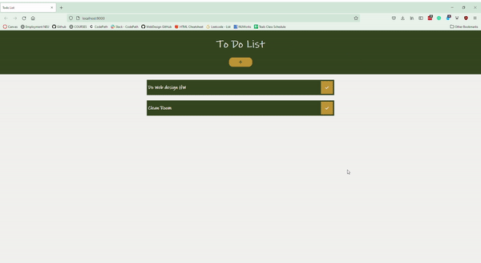

## To do List:



### Aim of the project
- Fetch and display tasks using an XHR call from a JSON file.
- Click on a to-do item to see its detailed view.
- A non-persisted view by clicking the add button to add details to the task.
- Add a to-do item by entering the title, description, due date, and time.
- Mark a to-do item as complete.
- Build the app using Webpack.

## Setup to run the Project
 - Clone or fork this repository
```
  git clone https://github.com/neu-mis-info6150-fall2021/assignment-6-AnjaliSajeevan.git
```
- Initalize npm
```
npm init -y
```
- Install webpack locally 
```
npm install webpack webpack-cli --save-dev
```
- Install css-loader and sass loader
```
npm install css-loader
npm install sass-loader
```
- To extract CSS into separate files
```
npm i mini-css-extract-plugin html-webpack-plugin --save-dev
```
- For live reloading install webpack with a development server
```
npm install webpack-dev-server --save-dev
```
-  To set the configuration
```
npx webpack --config webpack.config.js
```
-  To invoke webpack-dev-server
```
npx webpack serve
```

## Programming Language 
- HTML
- SCSS
- JavaScript

## Development Tools
 -  Visual Studio Code
 
## Personal Details
- Name: Anjali Sajeevan
- NUID: 001563277
